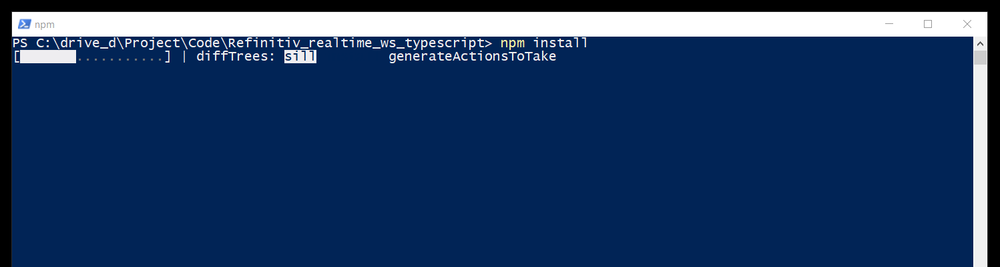
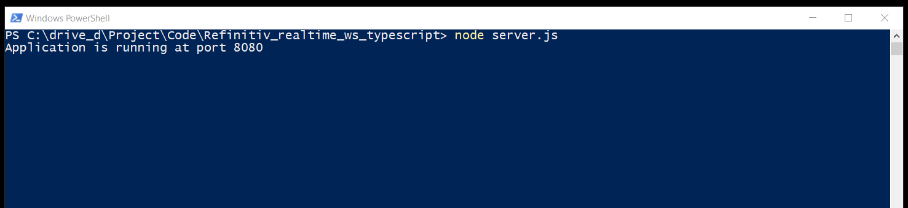

# Elecktron WebSocket API with TypeScript Example
## Overview

**Update**: March 2021.

[Websocket API for Pricing Streaming and Real-Time Service](https://developers.refinitiv.com/en/api-catalog/elektron/refinitiv-websocket-api) aka Websocket API enables easy integration into a multitude of client technology environments such as scripting and web.  This API runs directly on your Refinitiv Real-Time Distribution System and presents data in an open (JSON) readable format. The API supports all Refinitiv data models and can be integrated into multiple client technology standards e.g. JavaScript, Python, R, .Net, etc.

[TypeScript](https://www.typescriptlang.org) programming language is a typed superset of JavaScript that compiles to readable, standards-based JavaScript. The language is designed for application-scale JavaScript by adding optional types, classes, modules, ECMAScript 2015 features, and future proposals to JavaScript. TypeScript supports tools for large-scale JavaScript applications for any browser, for any host, on any OS. TypeScript is a first-class programming language in Microsoft Visual Studio, [Angular](https://angularjs.org/) web application platform. It also supported by various application frameworks like [React](https://github.com/Microsoft/TypeScript-React-Starter#typescript-react-starter), [NodeJS and Express framework](https://github.com/Microsoft/TypeScript-Node-Starter#typescript-node-starter), [ASP.Net Core](https://www.typescriptlang.org/docs/handbook/asp-net-core.html), [Vue.js](https://github.com/Microsoft/TypeScript-Vue-Starter#typescript-vue-starter), and more. 

This example shows how to implement the WebSocket API JavaScript web application with TypeScript. The web application source codes are implemented in TypeScript language to connect, consume and display data from the Refinitiv Real-Time Advanced Distribution server via the WebSocket API in the web browsers. All source codes will be compiled to readable JavaScript with [Webpack](https://webpack.js.org/) JavaScript module bundler.

*Note: The initial release of this API is for deployed Refinitiv Real-Time Advanced Distribution Server customers only (i.e. to use it you will need an installed version of Refinitiv Real-Time Advanced Distribution Server 3.2.1 and above). 

## Supported Web Browsers
The example supports Chrome/Microsoft Edge (Chrome-based version), Firefox, and IE11 (based on the WebSocket and Web Workers browser supported platform).

## Prerequisite
This example requires the following dependencies software.
1. [Node.js](https://nodejs.org/en/) runtime - version 8.9.3 or higher.
2. [npm](https://www.npmjs.com/) package manager (included in Node.js)
3. [TypeScript](https://www.typescriptlang.org) compiler (will be installed via ```npm install``` command)
4. [Express.js](https://expressjs.com/) web framework (will be installed via ```npm install``` command)

This example also uses the following 3rd party libraries for UI presentation.
1. [jQuery 3.2.1](https://jquery.com/) JavaScript library
2. [Bootstrap 3.3.7](https://getbootstrap.com/docs/3.3/) CSS library

jQuery,Bootstrap and Express.js are distributed under the [MIT license](https://opensource.org/licenses/MIT). Please see more detail in the LICENSE.md file.

*Note: This example uses jQuery and Bootstrap for Web UI theme and color only, not for HTML DOM interaction. 

## Package
The project includes complete TypeScript source codes, a simple Express.js web server application file, CSS files, and all required static dependencies. All dynamic dependencies for compiling and building JavaScript source files are defined in the *package.json* file which can be installed via ```npm install``` command.

The project includes the following files and folder
- *src/* folder: The folder that contains all TypeScript source files
- *web/* folder: The folder that contains all application web page files
    - *web/dist* folder: The folder that the compiled JavaScript file named *web_app.js* will be generated
    - *web/index.html*: The application HTML page
    - *web/css/cover.css*: The application CSS file
    - *web/libs/jquery-3.2.1.min.js*: jQuery library file
    - *web/bootstrap/css*, *web/bootstarp/fonts* and *web/bootstrap/js* folders: The folders for Bootstrap CSS and libraries files
- package.json: Project's NPM dependencies file
- tsconfig.json: Project's TypeScript compiler options file
- webpack.config.js: Project's Webpack compiler options file
- server.js: Project's simple web server application file. 

## How to run this example application
1. Unzip or download the example project folder into a directory of your choice 
2. Run ```$> npm install``` in the command prompt to install all the dependencies required to run the sample in a subdirectory called *node_modules/*.



3. If the machine is behind a proxy server, you need to configure Node.js uses proxy instead of a direct HTTP connection via the following command in a command prompt: ```set https_proxy=http://<proxy.server>:<port>```
4. Run ```$> npx webpack``` in the command prompt to build and compile all TypeScript files in *src* into JavaScript source file (*/web/dist/* folder)


5. Run ```$> node server.js``` in the command prompt to start the webserver at HTTP port 8080



6. Open a web browser (IE11, Chrome/Microsoft Edge (Chrome-based version), and Firefox), then navigate to index.html of the webserver at ```http://localhost:8080/index.html```


## References
For further details, please check out the following resources:
* [Refinitiv Real-Time & Distribution Family page](https://developers.refinitiv.com/en/use-cases-catalog/refinitiv-real-time) on the [Refinitiv Developer Community](https://developers.refinitiv.com/) web site.
* [WebSocket API page](https://developers.refinitiv.com/en/api-catalog/elektron/refinitiv-websocket-api).
* [Developer Webinar Recording: Introduction to Electron Websocket API](https://www.youtube.com/watch?v=CDKWMsIQfaw)
* [TypeScript programming language: Documentation](https://www.typescriptlang.org/docs/home.html).
* [Mozilla Developer Network: WebSocket API page](https://developer.mozilla.org/en-US/docs/Web/API/WebSockets_API)
* [WebSocket technology](https://www.websocket.org/index.html) web site.
* [Developer Article: Consume Realtime data with Refinitiv Data Platform](https://developers.refinitiv.com/en/article-catalog/article/consume-real-time-data-with-refinitiv-data-platform)
* [Developer Article: How to implement WebSocket API JavaScript application with HTML Web Workers](https://developers.refinitiv.com/en/article-catalog/article/how-implement-elektron-websocket-api-javascript-application-html-web-workers)
* [Developer Article: How to implement WebSocket API JavaScript application with TypeScript](https://developers.refinitiv.com/en/article-catalog/article/how-to-implement-elektron-websocket-api-javascript-application-typescript)
* [Developer Article: Consuming Order Book Level 2 data with Websocket API](https://developers.refinitiv.com/en/article-catalog/article/consuming-order-book-level-2-data-with-elektron-websocket-api)

For any questions related to this article or the WebSocket API page, please use the Developer Community [Q&A Forum](https://community.developers.refinitiv.com/spaces/152/websocket-api.html).

### Changelogs
- 21 December 2017: Fixed UI, change the service name to be an optional parameter, Add README.md content
- 11 January 2018: Now the application can handle subscription IDs.
- 28 January 2021: Rebranding.
- 17 March 2021: Update libraries.